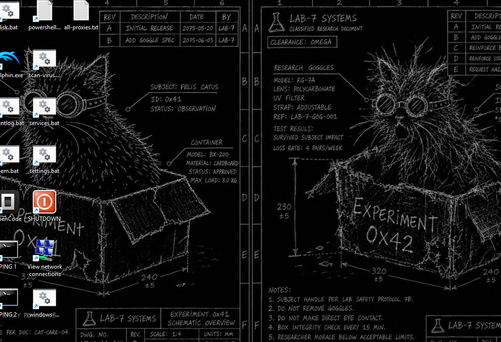

# WINSTOOLS — Windows Super Tools

> Windows Super Tools adalah utilitas manajemen & perawatan Windows berbasis **PowerShell + Windows Forms** dengan arsitektur **multi-session**: setiap tool berjalan pada tab independen dengan console output sendiri — beberapa tool dapat berjalan bersamaan tanpa saling menunggu.


**Status rilis:** `1.0.0.0` — build tersedia di [`Build\1.0\`](Build/1.0/winstools.exe), ditandatangani (Authenticode SHA256 + timestamp) dan valid.

> **Data runtime** (`CustomCommands.json`, log Virus Scan) tersimpan di **`%LOCALAPPDATA%\Winstools`** — bukan di folder exe, sehingga tidak tertimpa saat rebuild.



---

## Daftar Tools

| Kategori | Tool |
| --- | --- |
| Network | Clear DNS, Proxy Manager |
| Maintenance | Clear Logs, Disk Repair, Event Log, Win Update Reset |
| Advanced | Custom Command (tersimpan di `%LOCALAPPDATA%\Winstools\CustomCommands.json`) |
| Customization | God Mode, Set OEM |
| Security | Virus Scan (ClamAV) |

## Fitur

- **Multi-session** — setiap tool berjalan di tab sendiri dan dapat dibuka bersamaan.
- **Welcome dashboard** — ringkasan spesifikasi sistem: OS, CPU, RAM, GPU, penyimpanan, jaringan, status aktivasi Windows, BIOS.
- **Custom UI per tool** — UI didefinisikan langsung pada masing-masing modul tool (`Get-CustomUI`).
- **Console output berwarna** per session dengan log terstruktur: `[INFO] [WARNING] [ERROR] [SUCCESS]`.
- **Auto-scroll** pada menu & tab.
- **Elevasi otomatis** — meminta izin Administrator saat dijalankan.
- **Release ter-tanda-tangan** — setiap build ditandatangani sertifikat code signing (email `adyoix@gmail.com`) dan di-timestamp.

## Persyaratan

| Komponen | Keterangan |
| --- | --- |
| OS | Windows 10 / 11 |
| Runtime | PowerShell 5.1+ (bawaan Windows), .NET Framework 4.x |
| Hak akses | Administrator (elevasi otomatis) |
| *Build* | PowerShell + modul `ps2exe`; **OpenSSL** (khusus persiapan CA) |
| *Test* | Pester 3.4 atau 5.x (terbundel di Windows PowerShell 5.1) |

## Cara Menjalankan

### Dari source (mode development)

```powershell
powershell -ExecutionPolicy Bypass -File Scripts\Main.ps1
```

Mode log DEBUG: ubah `Initialize-Config -Environment 'Development'` pada `Scripts\Main.ps1`.

### Dari release (`Build\<versi>\winstools.exe`)

Folder hasil build bersifat **self-contained** — cukup double-click `winstools.exe`. Folder berisi `Modules\`, `Tools\`, dan `Icons\` yang otomatis disalin saat build.

---

## Cara Menjalankan Test

Test otomatis memakai **Pester** (3.4 — terbundel di Windows PowerShell 5.1 — atau 5.x, kompatibel keduanya).

```powershell
powershell -NoProfile -ExecutionPolicy Bypass -Command "Invoke-Pester -Script .\Test"
```

Yang diuji:

- **Sintaks** semua skrip & modul (`Scripts\`, `Build\`).
- **Modul tool** — setiap `Scripts\Tools\*.psm1` dapat di-import dan konfigurasinya valid.
- **Konsistensi runtime** — `CustomCommands.json` berada di `%LOCALAPPDATA%\Winstools`.
- **Metadata build** — `build.ps1` memiliki parameter `-Version`.

Test GUI manual (menampilkan form utama; memerlukan sesi interaktif):

```powershell
powershell -NoProfile -ExecutionPolicy Bypass -File .\Test\test_form.ps1   -AutoClose 5   # smoke test
powershell -NoProfile -ExecutionPolicy Bypass -File .\Test\close_test.ps1  -Scenario stuck # tutup bersih tanpa proses tersisa
```

---

## Tutorial Build (Stable)

> Jalur build resmi: **`Build\build.ps1`** — satu perintah untuk compile, patch metadata versi, tanda tangan digital, dan verifikasi. Diuji pada PowerShell 5.1.

### 1. Persiapan sekali pakai (per mesin developer)

**1a. Install OpenSSL** (khusus untuk pembuatan CA, bukan untuk build harian):

- Unduh dari <https://slproweb.com/products/Win32OpenSSL.html> (Win64 OpenSSL, `msi`).
- Tambahkan folder `bin` ke `PATH` (default: `C:\Program Files\OpenSSL-Win64\bin`), atau pastikan `openssl.exe` dapat dipanggil.

**1b. Buat Private CA + sertifikat code signing:**

```powershell
cd Build
powershell -ExecutionPolicy Bypass -File .\setup-ca.ps1
```

Skrip ini:

- Membuat **Root CA** (`CA\rootCA.crt`, sekali; hanya bila belum ada).
- Membuat kunci & CSR **code signing** dengan email `adyoix@gmail.com` di subject.
- Menerbitkan sertifikat code signing (`CA\winstools.crt`, 3 tahun) & mengekspor **`CA\winstools.pfx`** (password: `WINSTOOLS-CA-2026`).

> **Jangan pernah membagikan** `CA\rootCA.key`, `CA\winstools.key`, atau `winstools.pfx`. Simpan di tempat aman.

**1c. Install Root CA ke store mesin** (sekali per mesin, agar tanda tangan dianggap **Valid**):

```powershell
certutil -user -addstore Root CA\rootCA.cer
```

Atau: double-click `CA\rootCA.cer` → **Install Certificate** → **Local Machine** → *Place all certificates in the following store* → **Trusted Root Certification Authorities**.

> **Info:** tanda tangan tetap sah secara teknis meski tanpa langkah ini; namun Windows akan menampilkan *"Unknown Publisher"*. Langkah 1c menghilangkan peringatan tersebut.

### 2. Build harian

Setiap perubahan di `Scripts\` (Main.ps1, Modules, Tools) → jalankan:

```powershell
cd Build
powershell -ExecutionPolicy Bypass -File .\build.ps1
```

Versi diambil dari **parameter `-Version`** (default `1.2.0.0`); bisa format `1.0` atau `1.0.0.0` (otomatis dinormalisasi ke 4 bagian):

```powershell
powershell -ExecutionPolicy Bypass -File .\build.ps1 -Version 1.0
# → Build\1.0\winstools.exe (versi 1.0.0.0)
```

Alur build (`build.ps1`):

1. **Compile** `Scripts\Main.ps1` → `Build\<major.minor>\winstools.exe` (ps2exe, tanpa console window).
2. **Patch resource versi** — File Description, File Version, Product Name, Product Version, Company Name, Copyright, **Language: Indonesian (0x0421)**.
3. **Sign** dengan `CA\winstools.pfx` (SHA256 + timestamp DigiCert).
4. **Copy runtime** — `Modules\`, `Tools\`, `Icons\` disalin ke folder versi agar self-contained.
5. **Verify** — status tanda tangan ditampilkan.

Output:

```
Build\
├── build.ps1, setup-ca.ps1, set-versioninfo.ps1, Package.psd1   # tooling
└── <major.minor>\
    ├── winstools.exe        # aplikasi rilis
    ├── Modules\             # runtime (disalin otomatis)
    ├── Tools\
    └── Icons\
```

> Folder `Build\*\` (hasil build) tidak masuk repository (`.gitignore`) — cukup disimpan di rilis GitHub / distribusi manual.

### 3. Mengganti versi

Cukup beri parameter `-Version` saat build — **tidak perlu mengubah isi build.ps1**:

```powershell
powershell -ExecutionPolicy Bypass -File .\build.ps1 -Version 1.3.0.0
# → output di Build\1.3\winstools.exe
```

Nama folder output selalu `major.minor` dari versi tersebut.

### 4. Verifikasi tanda tangan

```powershell
(Get-AuthenticodeSignature .\Build\1.0\winstools.exe).Status
# Valid
```

Atau: klik kanan `winstools.exe` → **Properties** → tab **Digital Signatures** → detail sertifikat (termasuk email `adyoix@gmail.com`). Metadata aplikasi tampil di tab **Details**.

### Alternatif packaging (opsional)

Konfigurasi `Build\Package.psd1` untuk PowerShellProTools:

```powershell
Import-Module PowerShellProTools
Merge-Script -ConfigFile .\Package.psd1
```

> Jalur **ps2exe (build.ps1) adalah jalur resmi & teruji**; metode ini hanya cadangan.

---

## Struktur Project

```
winstools/
├── .github/workflows/       # CI: build dari tag v* + test Pester + artifact
├── Build/                  # tooling build + hasil per versi
│   ├── build.ps1           # build utama: compile + versi + sign + verify
│   ├── setup-ca.ps1        # buat CA & sertifikat code signing (sekali)
│   ├── set-versioninfo.ps1 # patch resource versi (bahasa Indonesia, dsb.)
│   ├── Package.psd1        # konfigurasi alternatif (PowerShellProTools)
│   └── <major.minor>/      # hasil rilis (self-contained, tidak di-commit)
│       ├── winstools.exe
│       ├── Modules/
│       ├── Tools/
│       └── Icons/
├── CA/                     # private CA & sertifikat (JANGAN dibagikan)
├── Icons/                  # sumber ikon aplikasi
├── Scripts/                # source code (development)
│   ├── Main.ps1            # entry point
│   ├── Modules/            # App, Config, Features, Session, UI
│   └── Tools/              # satu modul per tool
└── Test/                   # uji otomatis (Pester) + GUI smoke test
    ├── Winstools.Tests.ps1 # suite Pester utama
    ├── test_form.ps1       # smoke test form utama
    └── close_test.ps1      # regression: penutupan bersih tanpa proses tersisa
```

## Continuous Integration

`.github\workflows\build.yml` berjalan otomatis saat **tag `v*`** di-push (atau manual via *workflow_dispatch*):

1. Build Windows (`windows-latest`) — versi diambil dari tag (mis. tag `v1.0` → `-Version 1.0`).
2. Jalankan suite Pester; gagal → pipeline gagal.
3. Unggah `Build\*\` sebagai artifact rilis.

> Sertifikat signing tidak tersedia di CI (rahasia lokal) — build CI tidak ditandatangani. Build rilis resmi tetap lewat mesin developer dengan `build.ps1`.

## Troubleshooting

| Masalah | Solusi |
| --- | --- |
| Status tanda tangan `UnknownError` / *Unknown Publisher* | Install Root CA: `certutil -user -addstore Root CA\rootCA.cer` |
| `winstools.exe` terkunci saat build | Tutup aplikasi yang sedang berjalan, lalu ulangi build |
| Timestamp gagal | Pastikan koneksi internet ke `http://timestamp.digicert.com` |
| `openssl.exe` tidak ditemukan | Install OpenSSL dan pastikan masuk `PATH` |
| EXE tidak menemukan modul | Pastikan `Modules\` & `Tools\` berada di folder yang sama dengan EXE (build.ps1 melakukannya otomatis) |

## Keamanan

- `CA\rootCA.key`, `CA\winstools.key`, `CA\winstools.pfx` adalah **rahasia** — jangan masukkan ke repository atau distribusi.
- Password default PFX (`WINSTOOLS-CA-2026`) hanya untuk pengembangan; ganti untuk rilis produksi.
- Root CA Anda sendiri hanya menandatangani *mesin Anda sendiri* — ini **bukan** sertifikat publik; pengguna lain tetap melihat peringatan *Unknown Publisher*.

## Kontributor

Daftar kontributor proyek ini — lihat [CONTRIBUTORS.md](CONTRIBUTORS.md).

## Lisensi

Distribusi di bawah lisensi **MIT** — lihat [LICENSE](LICENSE).

Copyright © 2026 PT (Perorangan) Adidaya Karya Utama. All rights reserved.
